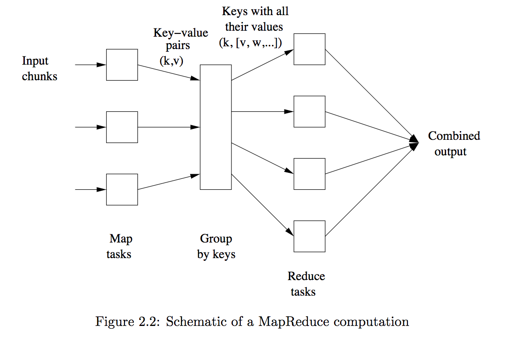

# Chapter 2 MapReduce and the New Software Stack
- Data-mining
    + often called "big-data" analysis
    + need manage immense amount of data quickly.
- The data
    + extremely regular
    + a ample opportunity to exploit **parallelism**.
- A new software stack has evolved.
- Programming systems for parallelism
    + Not from a "super-computer" but a "computing clusters"
        + commodity hardware, including conventional processors, connected by Ethernet cables or switches.
- Software stack
    - file system -- distributed file system
        + much larger than the disk blocks
        + provide data replication --> protect from failures.
    - programming system -- MapReduce
        - enable many most common calculations on large-scale data to be performed on computer clusters efficiently.
        - can tolerant of hardware failures during computations.
        - can be implementated by SQL
        - Greatest cost is communication.
## Distributed File Systems
- Advantages:
    - the power of the parallelism
    - avoid the realiability problems
### Physical Organization of Compute Nodes
- parallel-computing architecture -- **cluster computing**
- Store on racks
    - 8-64 each rack
- Connection:
    - same rack: gigabit Ethernet.
    - among racks: another level of network or **switch**
    - bandwith: interRack > intrarack
- Tree shaped
- Fail:
    - more components, higher frequency
    - Solution:
        - **Duplicate**: Files must be store redundantly.
        - **Divide**: Computations must be divided into tasks
### Large-Scale FIle-System Organization
- Distributed file system (DFS)
    - Google File System (GFS)
        - Original
    - Hadoop Distributed File System (HDFS)
        - Open source
        - Implementation of **MapReduce**
        - Distributed by Apache Software Foundation.
    - CloudStore
        - Developed by Kosmix
- Files
    - Enormous, Terabyte in size
    - Rarely updated
    - Divided into **chunks**
    - Replicated **multiple times** on different nodes & different racks.
    - **Master node or name node**
        - itself replicated
        - a directory knows where to find its copies.
        - All users know the copies
## MapReduce
- A style of computeing.
- Can manage many large-scale computations in a way that is tolerant of hardware faults.
- Functions
    - Map
    - Reduce
- The system manage the parallel execution for Map or Reduce and deal with failures
- Procedure
    - Convert **chunks** into **key-value pairs** (the way is dicided by user) by Map tasks
    - Gather **all key-value pairs** and divided among all Reduce tasks with the **same key**.
    - Work on one key each time and combine the values associated with that key in some way(decided by the user)

### The Map Tasks
- Files are seen as consisting of **elements**.
- **Chunk** is a collection of **elements**.
- **No elements** is stored **across two chunks**.
- **All inputs** to Map tasks and **outputs** of Reduce tasks are all **key-value** pairs.
- **Keys** are not meaningful.
- **Keys** do **not** need to be **unique**
- **Keys and values** are **all binary.**
- **elements --> |Map task| --> key-value pairs**
### Grouping by Key
- After the Map tasks, the key-value pairs are grouped by key, the values **formed a list** of values.
- **The master controller process** knows the number of Reduce tasks r,which is told by user.
- Procedure
    - Picks up a hash function
    - Apply it to keys
    - Produce a bucket number from 0 to r - 1
    - Merge the files from each Map task which has the same key.((k,[v1,v2,...vn]))
    - Hash the key which outputs by Map task.
    - Put the Key-value pairs into one of the r files.
    - Each file is destined for one Reduce map.
### The Reduce Tasks
- Input: (k,[v1,v2,...vn])
- Output: a sequence of zero or more key-value pairs.
    - same or different type with output of Map task.
- The reduce function is also called the **Reducer**
- Each Reduce task can have one or more reducers(different keys)
- The outputs will be merged into a single file.
-??? *Reducers may be partitioned among a smaller number of  Reduce tasks is by hashing the keys and associating each Reduce task with one of the buckets of the hash function.*
### Combiners
- When **Reduce function is associative and commutative**, we can put some of what the reduceres do to the **Map task**.
### Details of MapReduce Execution
- User program initiates process
    - Master controller
        - Creates Map task and Reduce tasks
        - Assign Map and Reduce tasks to Worker processes
        - Keep trach of the status of each task.(idle, execute, complete)
        - Schedule new task to the worker process who have executed the work.
    - Some Worker nodes
        - Map Worker Nodes
            - Input: chunks of files
            - Output: key-value pairs in a file for each Reduce tasks **on local disk**.
        - Reduce Worker Nodes
            - Input: all files
            - Output: a file
            - less Reduce tasks, for each Map tasks should create an intermediate file for each Reduce task. Too much Reduce tasks will lead files explode.
### Coping With Node Failures
- Master node fails --> entire MapReduce should be restarted
- Master managers other failures.
- Master can detect the failures, for it periodically pings the Worker processes.
- Map Worker fails
    - All works even completed one should be redone, for all intermediate files are unavailable now.
    - Master inform Reduce Worker that the location of the input files has changed.

### Summary
- User program initiates process on Master and worker nodes
- worker node executes a Maptask or a Reduce Maptask
- Each chunck of input data is processed by Maptask
- Each Maptask creates intermediate files for Reduce task
- Master keeps track of Map & Reduce tasks
- Reduce task executes and writes output to a file.
- Master fails ===> restart mapReduce job
- Mapworker fails ====> maptask(in-progress, completed)
Reduce worker fails ===> reduce task (in-progress)
